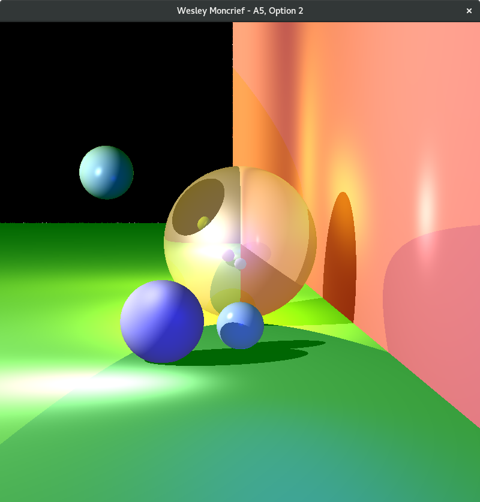

# Ray Tracer

I built this Ray Tracer from scratch in my computer graphics class. The program calculates
the local lighting by using the ambient, diffuse, and specular (Phong) terms.

It realistically shows both complex shadows and reflections.

The program currently cycles through different 'scenes' that I have generated, each of
which showcase some of its features.

